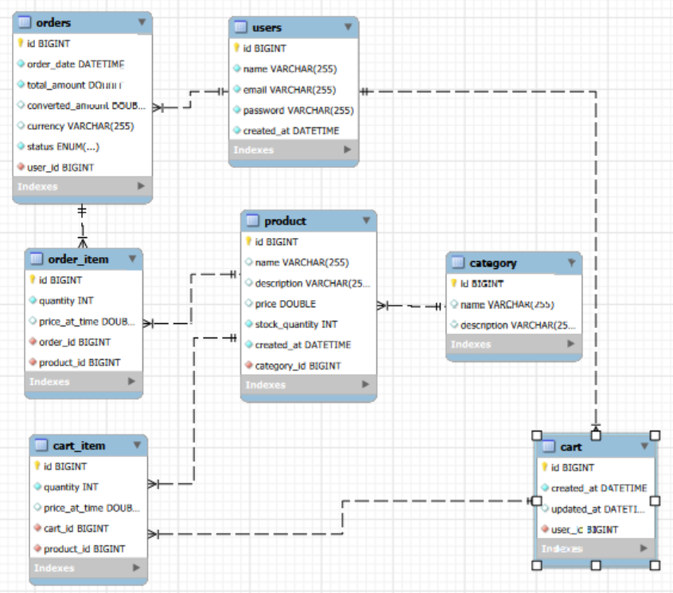
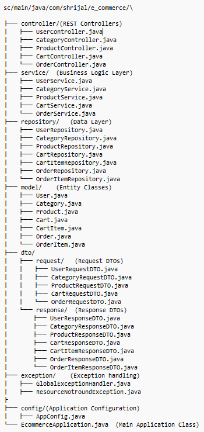
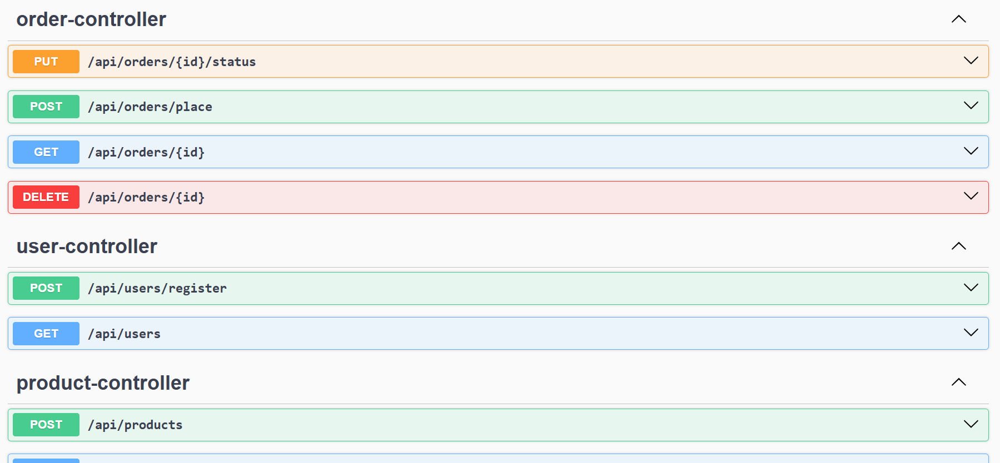
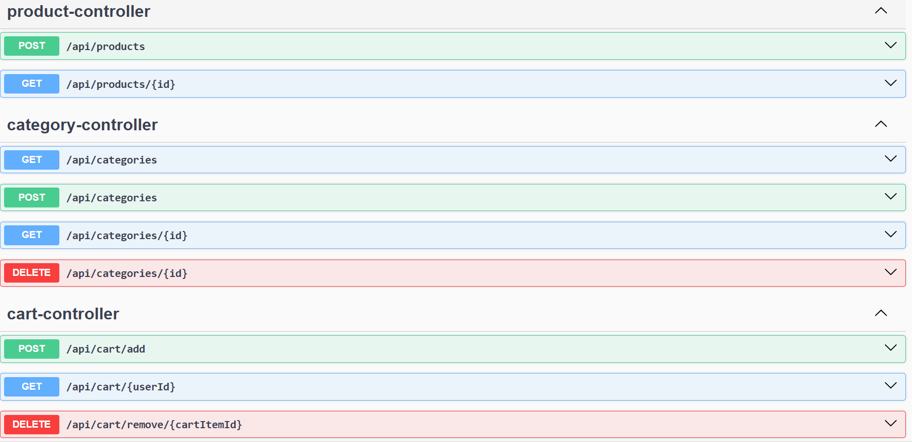

**E-Commerce Application**
- An E-Commerce application with features:
- User registration
- Product and category management
- Cart creation and Add-to-cart function
- Order placement with currency conversion via Frankfurter API

**Techs Used**
- Java
- Spring Boot
- JPA
- MySQL
- Swagger for API
- Frankfurther for currency conversion

**Entity Relation:**

**Foldr Structure:**

**Endpoints**

- POST /api/users/register - User data
- POST /api/categories - Category data
- POST /api/products - Product data
- POST /api/cart/add - Cart item data
- POST /api/orders/place - Order data
- PUT /api/orders/{id}/status - Status update data
- GET /api/users
- GET /api/categories
- GET /api/categories/{id}
- GET /api/products/{id}
- GET /api/cart/{userId}
- GET /api/orders/{id}
- DELETE /api/categories/{id}
- DELETE /api/cart/remove/{cartItemId}
- DELETE /api/orders/{id}

**Key Features:**

1. User Registration 
- Users are registered using the /api/users/register
- Response: 
- {
  "email": "shriiV@example.com",
  "id": 5,
  "name": "Shrii Verma"
  }
- We can get all the users by /api/users endpoint
- Response:
- [
  {
  "email": "max@example.com",
  "id": 3,
  "name": "Max"
  },
  {
  "email": "john@example.com",
  "id": 4,
  "name": "John Doe"
  },
  {
  "email": "shriiV@example.com",
  "id": 5,
  "name": "Shrii Verma"
  }
  ]

2. Cart
- Each user has one cart created automatically upon registration
- cartItems can be added to cart using /api/cart/add
- Response:
- {
  "cartId": 4,
  "items": [
  {
  "id": 3,
  "priceAtTime": 32000.0,
  "productId": 8,
  "productName": "Washing Machine",
  "quantity": 2
  }
  ],
  "totalAmount": 64000.0
  }

- Cart items store the price at the time of addition
- Supports adding, viewing, and removing items

3. Order Placement
- Orders are created from cart using user id
- Response:
- {
  "orderId": 3,
  "totalAmount": 42499.0,
  "convertedAmount": 469.03,
  "currency": "USD",
  "status": "PENDING",
  "items": [
  {
  "orderItemId": 4,
  "productId": 5,
  "productName": "Denim Jacket",
  "quantity": 1,
  "priceAtTime": 2499.0
  },
  {
  "orderItemId": 5,
  "productId": 4,
  "productName": "OnePlus",
  "quantity": 1,
  "priceAtTime": 40000.0
  }
  ]
  }
- Cart is automatically cleared after successful order placement

4. Currency Conversion
- Uses Frankfurter API (https://www.frankfurter.app/)
- Converts INR to any supported currency like USD, EUR
- Example response: "orderId": 3,
  "totalAmount": 42499.0,
  "convertedAmount": 469.03,
  "currency": "USD",
  "status": "PENDING",

- Includes error handling for invalid currencies
- Stores both original (INR) and converted amounts

5. The application includes error handling for:
- Invalid user/product/category IDs
- Empty cart during checkout
- Currency conversion failures
- Duplicate email registration
- Invalid input validation

6. Swagger
- Using swagger(http://localhost:8080/swagger-ui/index.html) for testing API

